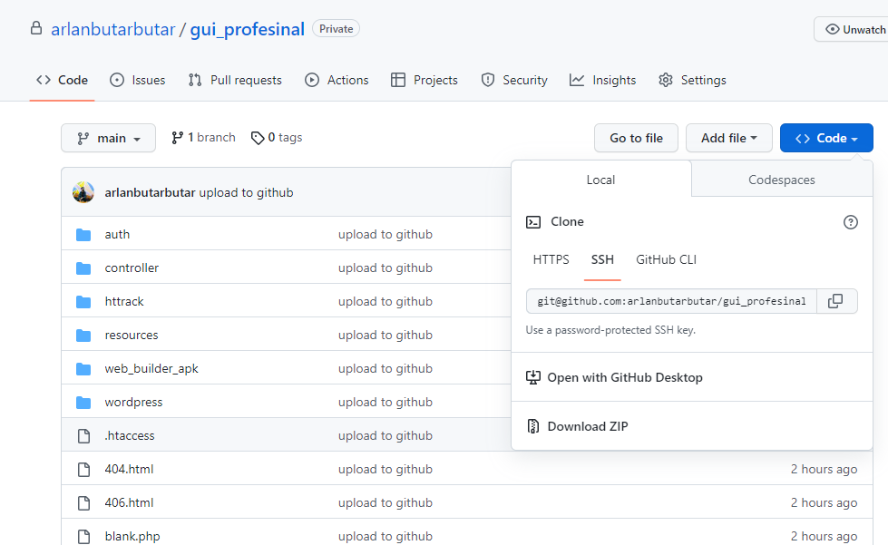

      

        

          Docs
          Ringkasan
        

        <h2 class="az-content-title">Ringkasan</h2>
        <h4>Netmedia Framecode</h4>
        
Netmedia Framecode adalah layanan pembuatan website yang dibuat dengan tujuan membantu UKM (Usaha Kecil Menengah) dalam melakukan digitalisasi. Kami berupaya melakukan perubahan dari sistem konvensional ke sistem digital sebagai bentuk peningkatan efektivitas dan efisiensi proses dan operasional bisnis UMKM. Dengan digitalisasi UMKM, pelaku usaha UMKM mengubah manajemen usahanya dari praktik konvensional menjadi modern.

        
Kami berkomitmen untuk menciptakan peluang bisnis yang lebih luas bagi UMKM untuk Go Global dengan digitalisasi.

        <h4>GUI - Netmedia Framecode</h4>
        
Kelola project kamu dengan Dashboard XAMPP yang telah kami desain ulang menjadi lebih kompleks dan didukung dengan aksesibilitas yang dapat mengontrol semua lembar kerja project kamu.

        
GUI dari Netmedia Framecode dibuat bertujuan untuk membantu programmer pemula agar dapat membuat sebuah aplikasi basic yang terstruktur dan dapat dengan mudah dipelajari. Mengapa mudah? itu karena kami menggunakan konsep prosedural dengan program pure Native agar pemula dapat memahami setiap baris code yang ada.

      
<!-- az-content-body -->
      
      
      

        

          Docs
          Pengantar
        

        <h2 class="az-content-title">Pengantar</h2>
        <h5>Mulailah dengan GUI, kerangka kerja yang dapat membuat situs dengan mudah dan cepat, dengan disediakan Framework dan halaman awal template Project Native.</h5>
        <h4 class="mt-4">Instalasi</h4>
        
Anda bisa klik link dibawah ini untuk mengunduh GUI.

        

          <a class="text-primary" style="cursor: pointer;" onclick="window.open('https://github.com/arlanbutarbutar/gui_profesional', 'blank')">https://github.com/arlanbutarbutar/gui_profesional</a>
        

        
Setelah anda mengunjungi link tersebut, klik tombol <strong>
            <> Code
          </strong> untuk mengunduh. Pilih beberapa cara unduhan yang anda bisa gunakan.

        
        <h6 class="mt-3 font-weight-bold">Cara pemasangan:</h6>
        
Melakukan pemasangan menggunakan <strong>HTTPS</strong> atau <strong>SSH</strong>

        

          <ol>
            <li>Salin link berikut jika HTTPS https://github.com/arlanbutarbutar/gui_profesional.git. Jika menggunakan SSH git@github.com:arlanbutarbutar/gui_profesional.git .</li>
            <li>Apabila sudah menyalin, anda buka <strong>Visual Studio Code</strong> atau aplikasi editor lainnya.</li>
            <li>Jika sudah, buka folder htdocs. Pastikan anda harus menaruhnya di dalam folder htdocs dan isi dari folder htdocs harus kosong atau tidak ada file apapun di dalamnya agar GUI dapat terbaca dengan benar.</li>
            <li>Berikut buka terminal dengan cara ketik <strong>Ctrl+Shift+`</strong></li>
            <li>Setelah terbuka, ketikan <strong>git clone</strong> lalu tempel <strong>HTTPS</strong> atau <strong>SSH</strong> yang sudah disalin. Sebagai contoh:
              <ol type="a">
                <li>git clone https://github.com/arlanbutarbutar/gui_profesional.git</li>
                <li>git clone git@github.com:arlanbutarbutar/gui_profesional.git</li>
              </ol>
            </li>
            <li>Jika sudah tekan <strong>enter</strong> dan tunggu hingga proses instalasi selesai.</li>
          </ol>
        

        
Jika pemasangan menggunakan <strong>HTTPS</strong> atau <strong>SSH</strong> terlalu sulit bagi anda, bisa dengan mengunduh langsung menggunkaan ZIP.

        

          <ol>
            <li>Sebelum mengunduh, pastikan terlebih dahulu isi dari folder htdocs harus kosong atau tidak ada file apapun di dalamnya agar GUI dapat terbaca dengan benar.</li>
            <li>Jika sudah, anda bisa mulai mengunduh dengan mengklik <strong>Download ZIP</strong> pada tombol <strong>
                <> Code
              </strong>.</li>
            <li>Tunggu hingga selesai, jika sudah terunduh masukan ke folder htdocs lalu extract seperti biasa.</li>
            <li>Setelah semuanya selesai, maka anda sudah dapat menggunakan GUI.</li>
          </ol>
        

        <h4 class="mt-4">Komunitas</h4>
        
Ikuti terus perkembangan GUI dan jangkau komunitas dengan bergabung bersama Grup Belajar kami.

        <a href="https://chat.whatsapp.com/IZw5MhQuQJY0XPYKcvRxSt">Grup Class Coder</a>
      
<!-- az-content-body -->
